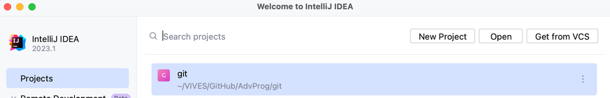
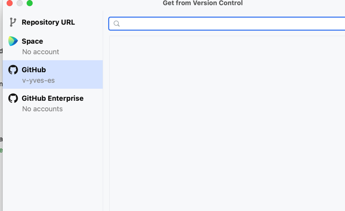
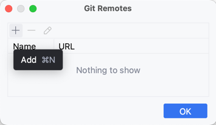
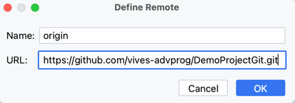
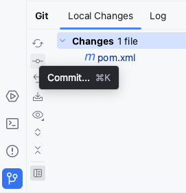
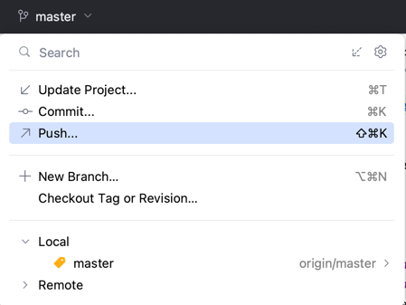
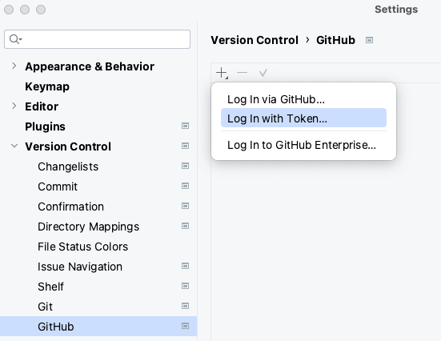
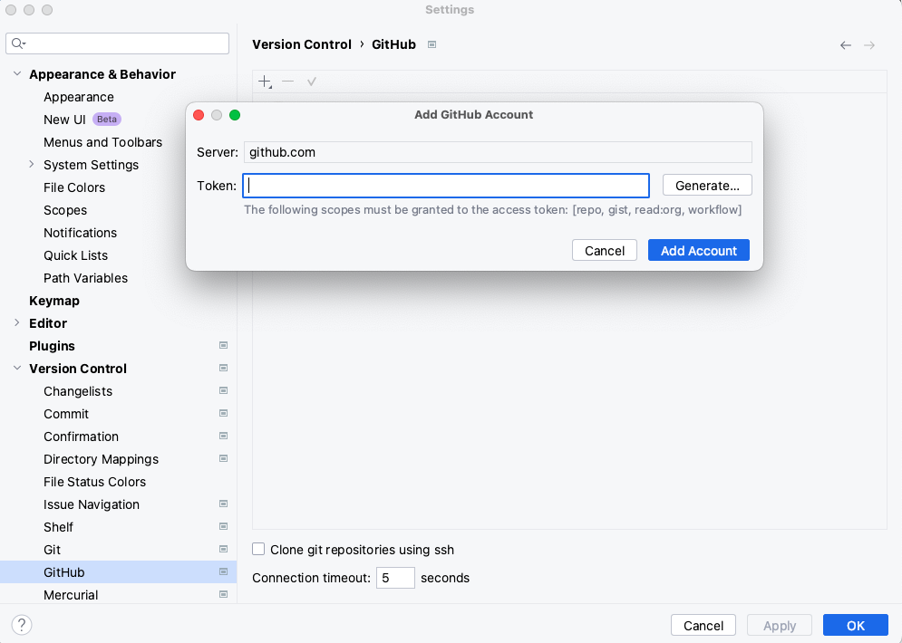

# Werken met git in Intellij

  * [Enable version control](#enable-version-control)
  * [Check out a project from a remote host: clone](#check-out-a-project-from-a-remote-host-clone)
  * [Exclude files from version control: ignore](#exclude-files-from-version-control-ignore)
  * [Check project status](#check-project-status)
  * [Add a remote repository](#add-a-remote-repository)
  * [Add, commit, push & pull](#add--commit--push---pull)
    + [Add/Commit](#add-commit)
    + [Push](#push)
    + [Pull](#pull)
    + [Update](#update)
  * [Log en History](#log-en-history)
    + [Log](#log)
    + [History](#history)
  * [Register a GitHub account](#register-a-github-account)

## Een remote git repository clonen
Bestaat er reeds een remote repository (bv. op GitHub) dan kan je deze repository clonen (= downloaden van de volledige remote git repository naar een lokale git repository met de volledige versie geschiedenis)

Open Intellij (zonder project te selecteren). Je krijgt het Welcome screen te zien



Klik rechtsbovenaan op **Get from VCS**

Of éénmaal Intellij al een project open heeft staan via:

>File | New | Get from Version Control**


>VCS | Project from Version Control**

Volgend scherm wordt getoond:


Kopieer de url van de remote git repository die je wil clonen. In onderstaande voorbeeld is dit https://github.com/vives-advprog/SorteerAlgoritmen.git


Geef de net gekopieerde url van de remote repository op in het veld URL en bepaal in welke directory je het project wil clonen.


Klik op clone

Merk langs de linkerkant van bovenstaand scherm ook een mogelijkheid op om alle repositories gekoppeld aan je GitHub account op te vragen en te clonen. Hiervoor dien je je GitHub account toe te voegen in Intellij (zie verder in dit document: Register a GitHub account)



## Een lokale git repository aanmaken
Bestaat er nog geen remote repository, maar je hebt wel al lokaal files (code) staan. Maak dan een lokale repository aan

Intellij menu: **VCS | Enable Version Control integration**


Kies `git` als Version Control system


Het project waarin je dit hebt uitgevoerd is nu een lokale git repository. Een `.git` folder wordt toegevoegd aan die map

## Exclude files from version control: ignore

Niet alle bestanden in het project wil je opnemen in version control.

Voeg in de root van je git repository een (hidden) bestand toe dat exact de volgende naam heeft: `.gitignore` .

In dit bestand kan je een opsomming geven van bestanden of mappen uit je project die je liever niet in je git repository wenst.

Dit kunnen bijvoorbeeld zijn:
* gebruikersspecifieke bestanden met de settings van je IDE bv.
* Bestanden en mappen die gegeneerd worden. Bv: target folder nu het builden van een project
* logfiles van je applicatie
* dependencies die via maven beheerd worden
* ...

> Voeg een .gitignore bestand toe aan ieder project dat je wil bijhouden in een git-repository. Voeg dit bestand toe nog voor je een eerste commit doet!

Intellij menu: **New | File** met de naam `.gitignore`

Volgende inhoud neem je minstens op in ieder `.gitignore` bestand binnen een Java project in Intellij
```
### Intellij ###

# .idea folder
.idea/

# File-based project format
*.iws
*.iml
*.ipr

# IntelliJ
out/
target/

# mpeltonen/sbt-idea plugin
.idea_modules/

### Mac OS ###
.DS_Store
```

## Check project status

In Intellij is het mogelijk om de status van je lokale directory te vergelijken met de repository versie van je project.

Intellij menu: **View | Tool Windows | Git**


* De **Default** lijst toont alle bestanden die zijn gewijzigd sinds de laatste keer dat je gesynchroniseerd hebt met de remote repository (blauw) en alle nieuwe bestanden die aan git zijn toegevoegd maar nog niet zijn gecommit (groen)

* De **Unversioned Files** lijst bevat alle bestanden die zijn toegevoegd aan het project, maar nog niet werden toegevoegd aan git (`git add <naam van het bestand>`)

## Add a remote repository

Wanneer je een Git project hebt gecloned van een remote repository, dan is de link tussen je local repository en de remote repository meteen ingesteld.

Als je echter start vanaf een local git repository die je wil synchroniseren met een remote git repository dan moet je de link naar de remote repository nog configureren in je git project.

Voorwaarde: Er bestaat reeds een lege remote repository (bv. op GitHub)


Voorwaarde: je project is reeds een local git repository

Intellij menu: **Git | Manage Remotes...**

Klik op de +



Name: origin

URL: `de url van de lege remote repository.git` (deze vind je terug in de blauwe balk op GitHub en eindigt op .git)



## Add, commit, push & pull

Er zijn meerdere mogelijkheden om in Intellij bestanden toe te voegen aan de staging area, bestanden te committen in de local repository of te pushen/pullen naar/van de remote repository

### Add/Commit

* Via de Git tool window: **View | Tool Windows | Git**



* Via het menu Git > Commit


* Rechts klikken op een file/folder/projectroot: **Git | Commit File/Directory... / Add**


* Via menubar


* CTRL+K (of ⌘K)

Na 1 van bovenstaande opties uit te voeren komt het Commit changes dialog tevoorschijn:


Bovenaan: Bestanden die reeds zijn toegevoegd aan local repository (groen en blauw) en bestanden die nog niet zijn toegevoegd onder Unversioned Files (rood)

Vink een _Unversioned File_ aan om deze toe te voegen aan je staging area = `git add pom.xml`

Commit message: geef een message mee die hoort bij de commit = `git commit -m "create new person"`

Diff: Vergelijk de wijzigingen per bestand tussen de staging area en je lokale repository

Rechts: vink de opties "Perform code analysis" en "Check TODO" af, vink "Optimize imports" aan

Onderaan:

* Commit  = `git commit`
* Commit and Push = `git commit & git push`


### Push

Nadat je alle wijzigingen hebt gecommit naar je lokale repository wil je deze ook doorvoeren naar je remote repository = `git push`

* Via de Git tool window: **View | Tool Windows | Git**
* Via het menu Git > Push
* Rechts klikken op een file/folder/projectroot: **Git | Push**
* Via menubar



* CTRL+Shift+K (of ⌘+Shift+K)

Na 1 van bovenstaande opties uit te voeren komt het Push dialog tevoorschijn met alle lokale commits opgelijst


### Pull

Ophalen van wijzigingen van remote repository naar lokale Repository = `git pull`

* Rechts klikken op een file/folder/projectroot: **Git | Repository | Pull**

### Update

* CTRL+T (of ⌘T)
* Intellij menu: **VCS | Update project**
* Icoon in menubar = Blauwe pijl naar beneden


Kies voor: _merge incoming changes into the current branch_


## Log en History

### Log

Lijst alle commits op met bijhorende wijzigingen

Intellij menu: **View | Tool Windows | Git**

Tabblad: Log


* Links: Overzicht van de verschillende branches, zowel op je local repository als op de remote repository
* Midden: Overzicht van alle commits
* Rechts: Source code die werd gewijzigd in de geselecteerde commit

Dubbel klik op 1 van die bestanden of kies voor Show Diff om de wijzigingen van die commit op te vragen


### History

Ophalen van de git history van 1 bestand

* Rechts klikken op een file: **Git | Show history**

In het Git Tool Window wordt een extra tabblad toegevoegd met de history van enkel dat bestand


## Register a GitHub account in Intellij

Intellij maakt het mogelijk om je GitHub repositories rechtstreeks te benaderen via de IDE.

Om toegang te krijgen tot je GitHub repositories moet je jezelf authenticeren door je GitHub account te registreren in Intellij. Dit doe je als volgt:

Open het Settings/Preferences scherm

Windows: **File | Settings**
MacOS: **Intellij IDEA | Preferences**

**Settings/Preferences | Version Control | GitHub**

Klik + om een GitHub account toe te voegen



Klik op Generate



Op de token generate pagina die wordt geopend geef je een beschrijving aan het token en laat je alle voorgeselecteerde scopes aangevinkt. 

Onderaan de pagina klik je op Generate Token. Een token wordt voor je aangemaakt.

Kopieer en plak het net aangemaakte token in Intellij

Add Account

Zie ook deze link om een GitHub account te registreren in Intellij: https://www.jetbrains.com/help/idea/github.html
